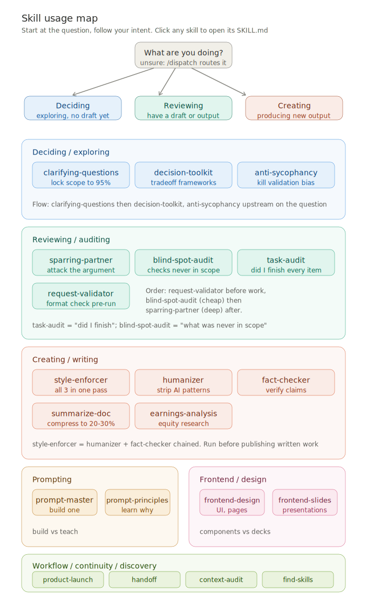

# Skill usage map

Which skill to run, by intent. Start at "what are you doing", follow your branch.

The diagram below is interactive inside Claude (tap any skill for its description). On GitHub it renders static — use the table underneath as the reference.

## How to use

Find what you're doing in the map, then run that skill's slash command (listed in the tables below). Where a panel names an order or a chain, follow it — e.g. run `request-validator` before work and `sparring-partner` after, or use `style-enforcer-pipeline` to run the three writing skills in one pass. Not sure which branch you're in? Run `/dispatch` and it routes you.

## By intent

### Deciding / exploring — no draft yet

| Skill | Invoke | When |
|-------|--------|------|
| clarifying-questions | `/clarifying-questions` | Request is ambiguous, lock scope to 95% before work |
| decision-toolkit | `/decision-toolkit` | Weighing options, need a tradeoff framework |
| anti-sycophancy | `/anti-syc` | Rewrite a validation-seeking question before answering |

Typical flow: clarifying-questions → decision-toolkit, with anti-sycophancy upstream on the question itself.

### Reviewing / auditing — have a draft or output

| Skill | Invoke | When |
|-------|--------|------|
| request-validator | `/validate` | Before work — does planned output match the request |
| blind-spot-audit | `/blind-spot` | After a multi-item edit — checks that were never in scope |
| task-audit | `/task-audit` | After a task — did I finish every assigned item |
| sparring-partner | `/sparring-partner` | Attack the argument; `/stress-test` mode for two-pass adversarial |

Order: request-validator before work, blind-spot-audit (cheap, structural) then sparring-partner (deep, semantic) after. task-audit answers "did I finish"; blind-spot-audit answers "what was never in scope".

### Creating / writing — producing new output

| Skill | Invoke | When |
|-------|--------|------|
| style-enforcer-pipeline | `/style-enforcer-pipeline` | All three below in one pass — run before publishing |
| humanizer | `/humanizer` | Strip AI writing patterns |
| fact-checker | `/fact-checker` | Verify claims, flag misinformation |
| summarize-doc | `/summarize-doc` | Compress a heavy document to 20-30% |
| earnings-analysis | `/earnings-analysis` | Equity research earnings update report |

style-enforcer-pipeline = humanizer + fact-checker chained with style enforcement.

### Prompting

| Skill | Invoke | When |
|-------|--------|------|
| prompt-master | `/prompt-master` | Build a production prompt |
| prompt-principles | `/prompt-principles` | Learn why a prompt underperforms (teach, not build) |

### Frontend / design

| Skill | Invoke | When |
|-------|--------|------|
| frontend-design | natural language | UI, components, pages |
| frontend-slides | `/frontend-slides` | HTML presentations / PPTX conversion |

### Workflow / continuity / discovery

| Skill | Invoke | When |
|-------|--------|------|
| product-launch | `/product-launch` | Full go-to-market plan |
| handoff | `/handoff` | Resume work in a fresh chat with no context loss |
| context-audit | `/context-audit` | Token waste and bloat in your Claude Code setup |
| find-skills | `/find-skills` | Discover and install skills you don't have yet |
| dispatcher | `/dispatch` | Routes any request above when you're not sure which to run |

---

21 skills. Archive/ excluded.
